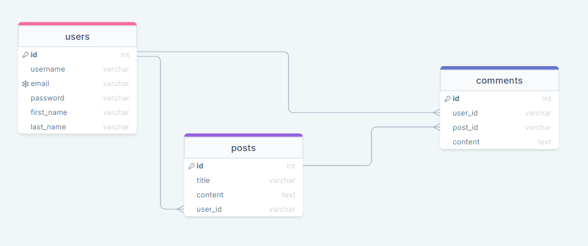

# Reddit-Tareq

 

    

## **Live Website**

You can check out our website here [**REDDIT**](https://reddit-tareq.herokuapp.com/).

## **About My Website**

This an reddit website that show the all posts from different users ,  
You can post and sign in , signup to be able to add your post 

## **User Journey**

The user enters the website and see all posts  

If the user need to post he should go first to sign up/login to sign 

then he will go to home page and can fill the form by title and content and click on post button to post his own post
and he can deleted the post by clicking on delete post and show it in new page by clicking on show button

# **Installation Guide**

## In your Git Bash

- Git clone https://github.com/CA-G12/Reddit-Tareq.git
- Change the current directory and type cd ./Reddit-Tareq
- When you open it, don't forget to add a .env file with DEV_DATABASE_URL = 'here add your postgres database'.
- Run the server locally by typing the command npm run dev in your terminal.

# **Built with**

- HTML5
- CSS3
- JavaScript
- Postgres SQL
- Express modules
- Git & Github
- Heroku

# By Me : 

- [Tareq abuaqlain ](https://github.com/tareq-abuaqlain)

# DB Schema

